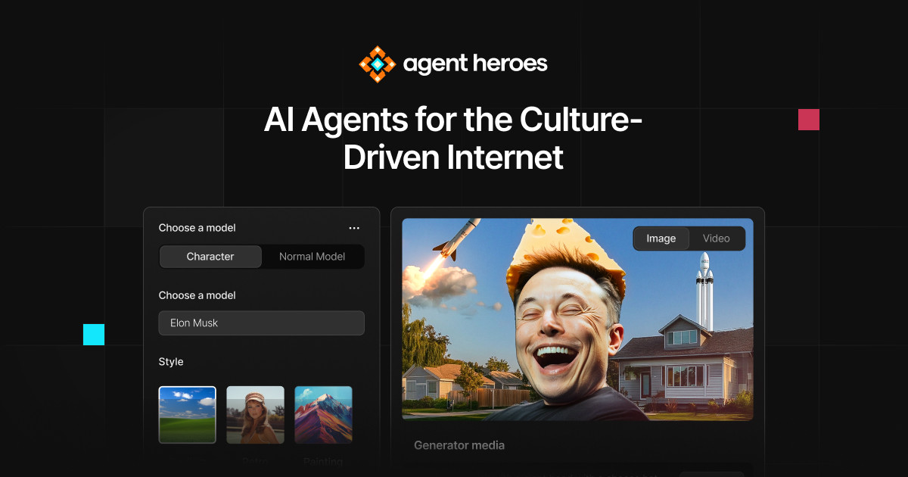

# AgentHeroes project

<i> More than a meme generator. It’s a control panel for digital storytelling: static images, video memes.</i>



## 🚀 Project Structure

Inside of your Astro project, you'll see the following folders and files:

```text
/
├── public/(static files)
│   └── favicon/
│   │   └── favicon.ico
│   └── fonts/
│   │   └── Inter/
│   └── images/
│   │   └── advantage/
│   │   └── billboard/
│   │   └── hero/
│   │   └── logo.svg
│   │   └── og-image.jpg
│   └── video/
│   │   └── 4.mp4(video for hero section)
│   └── .htaccess
│   └── robots.txt
├── src/
│   ├── components/
│   │   └── ui
│   │   │   └── ui components(Button.astro and other)
│   │   └── components for pages
│   ├── icons/
│   │   └── svg icons(for sprite)
│   ├── layouts/
│   │   └── Base.astro(layout for page)
│   └── pages/
│       └── index.astro(and other pages)
└── astro.config.mjs(base config for astro.js)
└── package.json
```

## 🧞 Commands for start project

All commands are run from the root of the project, from a terminal:

| Command                   | Action                                           |
| :------------------------ | :----------------------------------------------- |
| `npm install`             | Installs dependencies                            |
| `npm run dev`             | Starts local dev server at `localhost:4321`      |
| `npm run build`           | Build your production site to `./dist/`          |
| `npm run preview`         | Preview your build locally, before deploying     |
| `npm run astro ...`       | Run CLI commands like `astro add`, `astro check` |
| `npm run astro -- --help` | Get help using the Astro CLI                     |

## 👀 Want to learn more?

Feel free to check [our documentation](https://docs.astro.build).
